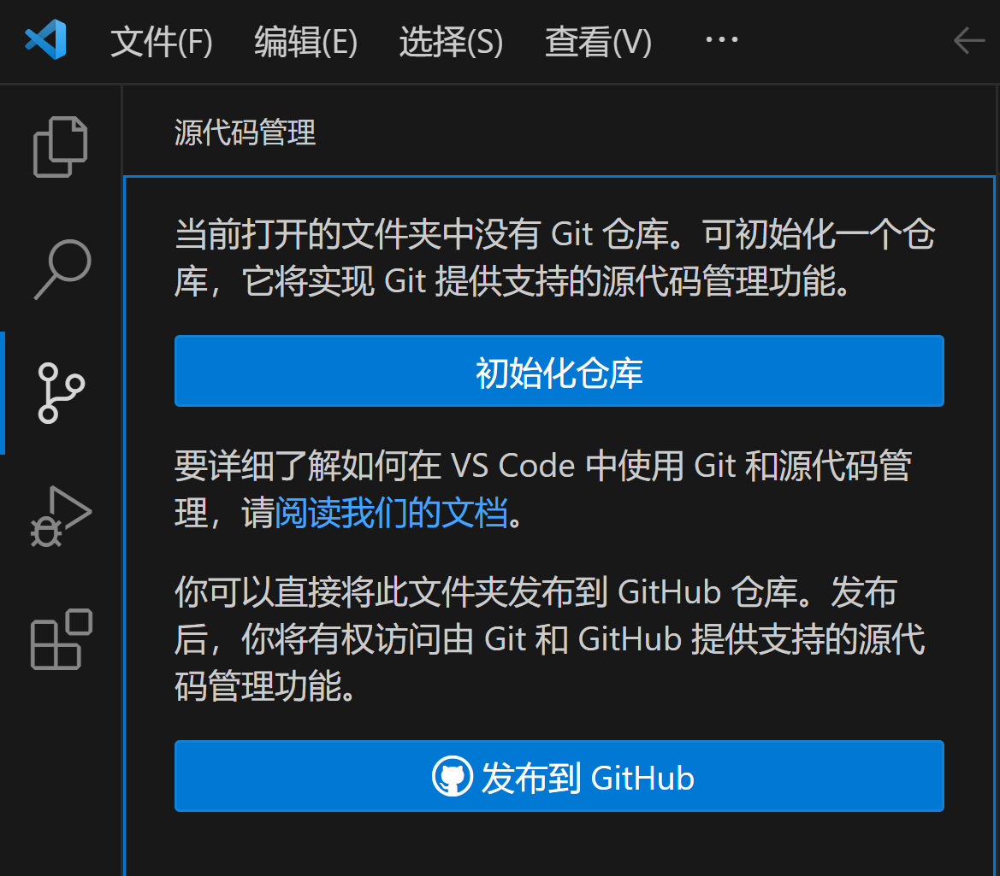
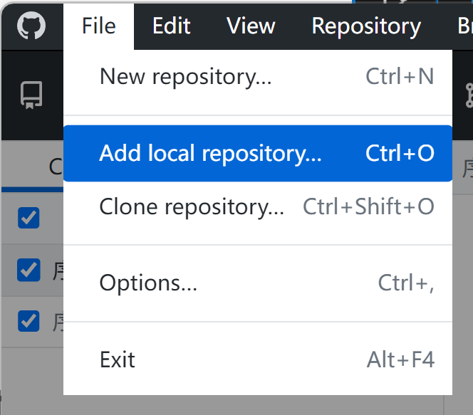
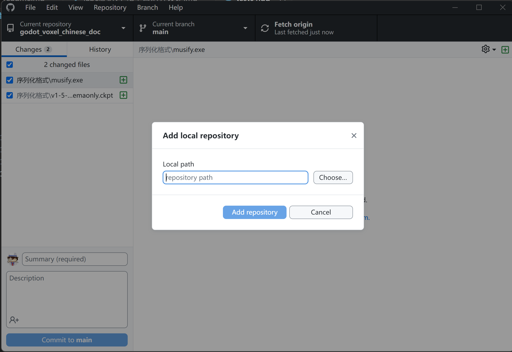
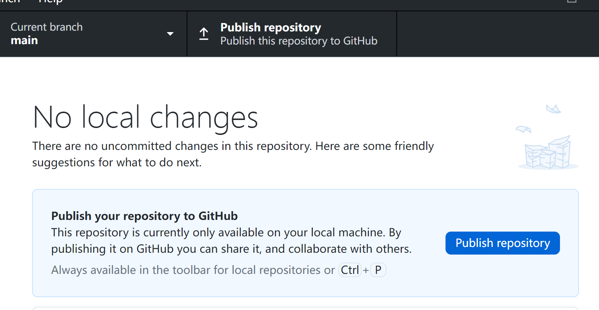

## 创建本地笔记项目

创建本地笔记项目很简单，就是找一个本地磁盘目录，创建一个文件夹，并在其中创建任意的文件夹架构和.md文件。

可以通过Typora或VSCode以及其他的离线MarkDown编辑器或笔记软件书写内容。

## 初始化仓库

基于Git或者说GitHub写作的本质是为笔记项目的文件夹创建本地Git仓库，并发布为GitHub的远程仓库。

Git提供版本管理，GitHub提供云存储。

### 为笔记项目创建本地Git仓库

创建本地Git仓库，本质就是对笔记项目的文件夹根路径实施**Git初始化**操作。

有很多方法可以使用，一种是用Git自带的命令行。也可以使用TortoiseGit或者VSCode实现初始化。

## 创建GitHub远程仓库

初始化笔记项目目录后，就可以用GitHubDeskTop创建远程仓库了。点击“File”菜单下的“Add local repository...”

在弹出的对话框中选择本地仓库的目录。

然后点击“Publish repository”按钮就可以将当前本地仓库正式推送到远程仓库。

推送完毕，打开GitHub，就可以在你的主页找到笔记项目的仓库了。